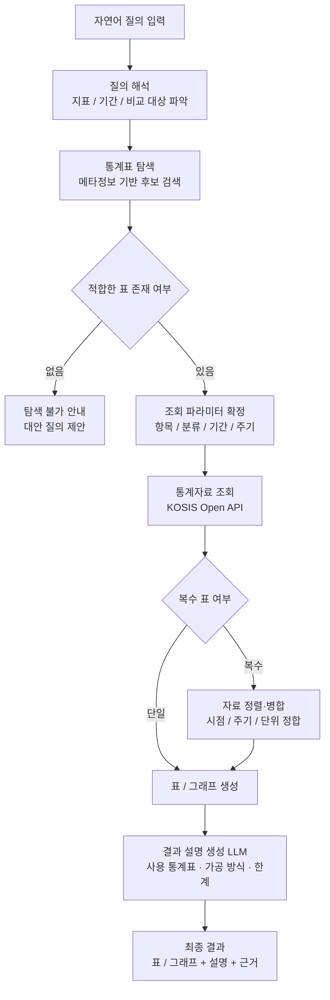

# 한국은행통계 탐색·시각화 에이전트 프로젝트

- 출처: https://psychedelic-uncle-650.notion.site/3d631c089bcd806a93dcf46c4dc94c4b
- 수집일: 2026-09-14
- 보완: 2026-09-14 동일 출처 페이지의 미수록 후반부(일정·관찰 질문·MCP 툴 구성·평가 설계·최종 산출물) 추가
- 성격: 기업(클라비)이 최초 제공한 프로젝트 소개 문서 (원문 보존, 편집 없음)

---

## 공통 안내

> (원문에 안내 블록이 있으나 표시할 내용이 없음)

---

## 프로젝트 개요

### 1. 프로젝트 소개

> 한국은행 통계 기반 자연어 데이터 탐색·시각화 에이전트 및 MCP 서버 개발

본 주제는 클라비 내부 연구 과제로 기획된 프로젝트로, 공공 통계 데이터를 자연어로 탐색·취합·시각화하는 에이전트의 기술적 타당성을 검토하기 위한 목적을 가집니다. 교육생 프로젝트를 통해 PoC(개념검증)를 선행 수행하고, 에이전트와 MCP 서버의 성능을 정량적으로 평가할 수 있는 체계까지 함께 확보하고자 합니다.

- KOSIS Open API 내 한국은행 소관 통계표를 대상으로, 자연어 질의에 맞는 통계표를 찾고, 필요한 경우 여러 표의 자료를 취합·병합하여 표 또는 그래프로 제시하는 AI 에이전트 PoC 개발
- 단순 키워드 검색이나 단일 표 조회 수준을 넘어, 자연어 질의 → 통계표 탐색 → 자료 조회·병합 → 표/그래프 생성 → 결과 설명까지 수행하는 구조를 목표로 함
- 에이전트가 사용하는 데이터 조회·가공 기능을 자체 MCP 서버로 구현하여, 외부 LLM 클라이언트에서도 재사용 가능한 형태로 제공
- 통계표 기반 요청 예시 골든셋을 직접 제작하고, 이를 통해 에이전트와 MCP 서버의 성능 평가 체계를 구축·제안

---

## 프로젝트 목표

### 1. 문제 배경

- KOSIS에는 수십만 건의 통계표가 있고, 한국은행 소관 표만 해도 수백 개에 이름. 사용자는 "중소기업 대출 연체율이 어디 있는지", "기준금리와 대출금리를 같이 보려면 어떤 표를 합쳐야 하는지"를 알기 어려움
- 통계표 이름·분류 항목은 행정 용어 중심이라 일반 사용자의 표현과 차이가 크고, 원하는 자료를 찾기 위해 표 ID·항목 코드·분류 코드를 수작업으로 탐색해야 함
- 여러 표를 함께 보려면 시점·주기·단위가 서로 달라 엑셀에서 수작업으로 정렬·병합하는 경우가 대부분이며, 이 과정에서 실수가 발생하기 쉬움
- 최근 LLM 에이전트와 MCP(Model Context Protocol) 기반 도구 연동이 확산되면서, 공공 데이터를 자연어로 다루는 수요가 커지고 있으나, 정확성을 검증할 수 있는 평가 체계는 아직 부족함

### 2. 프로젝트 목표

- 자연어 질의로부터 적합한 한국은행 통계표를 탐색하고, 단일·복수 표의 자료를 조회·병합하여 표/그래프로 제시하는 에이전트 PoC 구축
- 통계표 탐색·조회·가공 기능을 MCP 서버로 구현하여 에이전트 및 외부 클라이언트에서 활용
- 통계표 기반 요청 예시 골든셋을 제작하고, 이를 활용한 에이전트·MCP 성능 평가 방법을 설계·제안

### 3. 기대 성과

> 단순 데모 구현이 아닌, 결과의 정확성을 측정하고 개선할 수 있는 구조 설계를 권장

- 자연어 → 한국은행 통계표 탐색 검색기 구현
- 단일·복수 통계표 자료 조회 및 병합 로직 설계
- 표/그래프 생성 에이전트 구현
- KOSIS 한국은행 통계 MCP 서버 구현 및 외부 클라이언트 연동 시연
- 요청 예시 골든셋 및 평가 체계 구축, 성능 측정 결과 보고
- End-to-End 흐름을 갖춘 서비스 또는 API 형태 결과물

### 4. 처리 프로세스

- 통계표 메타정보 수집 및 정리
- 자연어 질의 해석 및 필요 정보 파악
- 통계표 탐색 (후보 검색 및 선택)
- 조회 파라미터 확정 (항목 / 분류 / 기간 / 주기)
- 통계자료 조회 (KOSIS Open API 활용)
- 복수 표 자료 정렬·병합 및 가공
- 표 또는 그래프 생성
- 결과 설명 생성 및 근거(사용 통계표) 제시

---

## 핵심 기능 요구사항

### 1. 기능 구성 제안

- a. 자연어 → 통계표 탐색 검색기
- b. 통계자료 조회 및 복수 표 병합 (KOSIS Open API 활용)
- c. 표 / 그래프 생성 에이전트
- d. MCP 서버 구현 및 외부 클라이언트 연동
- e. 골든셋 제작 및 성능 평가 체계 구축·제안
- f. 그 외 확장 (수치 검증, 리포트 생성 등)

### 2. 기능별 예시

> 🔗 대상 범위 : KOSIS 통계목록에서 통계 작성기관이 한국은행인 통계표
> (예: 통화·금융, 금리, 환율, 국제수지, 국민계정, 기업경영분석, 기업경기실사지수, 소비자동향조사 등)

> 🔗 예시 질의 : "최근 3년간 기준금리와 예금은행 가계대출 금리 추이를 한 그래프로 보여줘"

#### a. 자연어 → 통계표 탐색 검색기

- 한국은행 통계표의 메타정보(표 이름 · 분류 · 항목 · 단위 · 수록 기간)를 수집·정리
- 자연어 질의로부터 관련 통계표 후보를 검색하고 순위화
- 질의 표현과 통계표 명칭의 차이(예: "집값" ↔ "주택가격지수", "대출금리" ↔ "예금은행 가중평균금리")를 극복하는 방법 설계

> "기준금리", "가계대출 금리" 각각에 대응하는 통계표 후보를 검색하고, 그중 적합한 표를 선택

#### b. 통계자료 조회 및 복수 표 병합

- 선택된 표에 대해 항목 · 분류 · 기간 · 주기 파라미터를 확정하고 통계자료 API 호출
- 복수 표의 자료를 하나의 데이터셋으로 병합
- 표마다 다른 시점 표기 · 주기(월/분기/연) · 단위를 정합하는 규칙 설계

> 기준금리(변경 시점 기준)와 가계대출 금리(월별)를 동일한 월 단위 시계열로 정렬한 뒤 병합

#### c. 표 / 그래프 생성 에이전트

- 질의 의도에 맞는 표 형식 또는 그래프 종류(선 · 막대 · 복합 등) 선택
- 병합된 데이터로 표/그래프를 생성하고, 축 · 단위 · 범례를 명시
- 어떤 통계표를 어떻게 가공했는지 근거와 한계를 포함한 설명 생성

> 두 금리를 하나의 선 그래프로 표시하고, 사용한 통계표 ID · 항목 · 가공 방식을 함께 제시

#### d. MCP 서버 구현 및 외부 클라이언트 연동

- 통계표 탐색 · 메타 조회 · 자료 조회 · 병합 · 시각화 등의 기능을 MCP 툴로 정의하고 서버로 구현
- 자체 에이전트뿐 아니라 외부 MCP 클라이언트(Claude Desktop 등)에서 동일한 툴을 호출하여 동작 시연
- 툴의 입력·출력 스키마를 명확히 정의하여 재사용성과 평가 가능성 확보

#### e. 골든셋 제작 및 성능 평가 체계 구축·제안 (필수 과제)

- 한국은행 통계표를 기반으로 요청 예시와 기대 결과로 구성된 골든셋을 직접 제작
  - 단일 표 조회 요청, 복수 표 병합 요청, 애매하거나 대응 표가 없는 요청 등 유형별로 구성
  - 요청별 기대 결과의 형식과 정답 기준은 교육생이 정의
- 골든셋을 활용하여 에이전트와 MCP 서버 각각의 성능을 측정하는 방법을 설계·제안
- 측정 결과를 바탕으로 개선 전후를 비교하고, 정성적/정량적 평가 지표를 정리하여 제출

> 생각해볼 점
> - 그래프나 표가 "정확하다"는 것은 무엇으로 판단할 수 있을까요? 무엇과 무엇을 비교해야 할까요?
> - 통계표 탐색 성능, 자료 조회 성능, 시각화 성능은 같은 방법으로 평가할 수 있을까요?
> - MCP 서버의 성능과 에이전트의 성능은 어떻게 분리해서 측정할 수 있을까요?

#### f. 그 외 확장 (선택)

- 수치 검증 에이전트 — 에이전트가 생성한 표/그래프/설명에 포함된 수치를 원본 통계표와 대조하여 오류를 잡는 검증 단계
- 리포트 생성 에이전트 — 복수 질의 결과를 종합하여 사용 통계표 인용이 포함된 분석 리포트를 생성
- 선택적으로 확장 구현 가능하며, 핵심 기능(a~e)의 정확성이 확보된 이후 진행 권장

---

## 제공 리소스

### 1. 기술 및 인프라 제공

NCP AI Service API Key 제공 (AI 모델 활용)

참고: 클라비 기업 프로젝트 안내 > 제공 리소스

> - HCX-DASH-001, 002
> - HCX-003, 005, 007
> - 리랭커 모델
> - RAG Reasoning 모델
> - 임베딩 모델 v1, v2

### 2. 데이터 및 연계 리소스

- KOSIS Open API
  - KOSIS 공유서비스 — https://kosis.kr/openapi/devGuide/devGuide_0201List.do (코시스 공유서비스, OPEN API)
  - 통계목록 : 통계표의 목록구성 정보 제공
  - 통계자료 : 통계표의 수치자료 및 메타정보(수록정보, 출처, 단위 등) 제공
  - 메타정보 : 통계자료에 대한 메타자료 제공(통계표 명칭, 기관명칭, 분류/항목, 주석, 단위, 출처, 가중치 등)
  - 통계설명 : 통계조사에 대한 설명자료 제공

---

## 기술적 제약사항 및 조건

### 1. 환경

- Python 기반 개발 환경 권장
- 대규모 언어모델(LLM) 및 에이전트 프레임워크 활용 (예: LangGraph 등)
- 벡터 데이터베이스 및 검색 기술 활용 (예: 임베딩 검색, 하이브리드 검색, 리랭킹)
- MCP 서버 구현 (Python SDK 등)
- API 기반 데이터 연동 및 처리
- 간단한 웹 서비스 또는 API 서버 구현 (예: FastAPI 등)

### 2. 데이터 활용 원칙

- 탐색·조회 대상은 KOSIS 내 **한국은행 소관 통계표**로 한정
- 표/그래프에 사용되는 모든 수치는 **KOSIS Open API 조회 결과**를 기준으로 하며, 모델이 수치를 생성하지 않도록 구조 설계
- 결과에는 **사용한 통계표와 가공 방식**이 항상 함께 제시되어야 함

---

## 프로젝트 진행 일정 (원문)

> 본 프로젝트는 하나의 시스템을 6~7주 동안 단계적으로 완성하는 과정입니다. 아래 주차별 흐름은 정답이 아니라 **탐구 방향**이며, 구체적인 설계와 순서는 교육생이 데이터를 직접 관찰하며 정합니다. 단, 골든셋 제작은 초기에 착수하여 프로젝트 전 기간에 걸쳐 보완하는 것을 권장합니다.

| 주차 | 탐구 방향 | 주요 산출물 |
|---|---|---|
| 1주 | 한국은행 통계표 관찰(EDA) · 골든셋 초안 제작 | 통계표 요약 · 골든셋 v1 · EDA 리포트 |
| 2주 | 자연어 → 통계표 탐색 검색기 | 검색기 · 탐색 성능 측정 결과 |
| 3주 | 통계자료 조회 · 복수 표 병합 툴 · MCP 서버 초기 구현 | MCP 툴 n종 · 병합 규칙 정의서 |
| 4주 | 표 / 그래프 생성 에이전트 · End-to-End 연결 | 에이전트 · 시연 예시 |
| 5주 | 평가 체계 설계 · 에이전트 및 MCP 성능 측정 | 평가 방법 제안서 · 측정 결과 |
| 6주 | 성능 개선 반복 · 확장 기능(수치 검증 / 리포트) 시도 | 개선 전후 비교 · 확장 기능 |
| 7주 | 정리 · 문서화 · 발표 준비 (여유 주차) | 최종 결과물 · 발표 자료 |

**핵심 아이디어**: 통계표를 먼저 관찰해야 어떤 질의가 들어올 수 있고 어떤 결과가 정답인지 정할 수 있습니다. 골든셋은 이 관찰의 산출물입니다.

### ① 통계표 관찰

- 한국은행 소관 통계표는 몇 개이고, 어떤 분류 체계로 묶여 있나요?
- 표 이름 · 항목 · 분류 · 단위 · 주기는 어떤 형식인가요? 표마다 얼마나 다른가요?
- 사용자가 쓸 법한 표현과 통계표 명칭은 얼마나 다른가요?
- KOSIS API는 어떻게 활용하나요? 통계목록 · 메타정보 · 통계자료 API는 각각 무엇을 돌려주나요?

### ② 골든셋 초안 제작

- 어떤 유형의 요청을 포함해야 할까요? (단일 표 / 복수 표 / 대응 표 없음 / 애매한 표현 등)
- 요청별 "기대 결과"는 무슨 형식으로 적어야 나중에 비교가 가능할까요?
- 몇 건이면 충분할까요? 유형별 비율은 어떻게 정할까요?

### 검색기 설계 질문

- 메타정보 중 무엇을 검색 대상 텍스트로 만들까요? 표 이름만? 항목·분류까지?
- 임베딩 검색만으로 충분한가요, 키워드 검색이나 리랭킹이 필요한가요?
- 후보가 여러 개일 때 최종 선택은 누가(모델 / 규칙 / 사용자) 하나요?

### MCP 툴 구성 (예시 방향이며, 조합은 자유)

- 통계표 탐색 — 자연어 질의로 통계표 후보를 반환
- 메타 조회 — 특정 표의 항목 · 분류 · 단위 · 수록 기간을 반환
- 자료 조회 — 파라미터가 확정된 표의 수치 자료를 반환
- 정렬·병합 — 복수 표 자료를 주기 · 시점 · 단위 기준으로 정합하여 병합
- 표/그래프 생성 — 병합된 자료로 표 또는 그래프를 생성

> 생각해볼 점: 월별 표와 분기별 표를 합칠 때 어떻게 맞추나요? 단위가 "십억원"과 "%"인 표를 한 그래프에 그릴 수 있나요? 어떤 판단을 모델에게 맡기고 어떤 판단은 코드로 고정할까요?

- 질의 의도에 따라 표 vs 그래프, 그래프 종류를 어떻게 결정하나요?
- 에이전트가 툴을 어떤 순서로 호출해야 하며, 중간에 실패하면 어떻게 복구하나요?
- 결과 설명에는 무엇이 반드시 들어가야 하나요? (사용 표 · 가공 방식 · 한계)

### 평가 체계 설계

골든셋으로 무엇을 무엇과 비교하여 점수를 낼지 설계하고 제안합니다.

- 탐색 · 조회 · 병합 · 시각화 각 단계의 성능과 End-to-End 성능을 어떻게 나눠서 볼까요?
- MCP 서버 자체의 성능(툴 호출 정확도, 응답 정확도)은 에이전트와 분리하여 측정할 수 있나요?
- 개선 전후 차이가 실제 개선인지, 우연한 변동인지 어떻게 확인할까요?
- 측정 결과에서 가장 많이 틀리는 단계는 어디인가요? 그 단계부터 개선합니다.

### 확장

핵심 기능이 안정된 팀은 수치 검증 에이전트, 리포트 생성 에이전트 등 확장 기능을 시도합니다.

### 생각해볼 점 (전체)

- 이 도구가 없을 때, 사람이 한국은행 통계표 두 개를 합쳐 그래프 하나를 만드는 데 얼마나 걸리나요? 이 도구는 그 시간을 얼마나 줄이나요?
- 에이전트가 자신 있게 틀린 그래프를 내놓는 것과, "찾을 수 없다"고 답하는 것 중 어느 쪽이 더 나쁜가요?
- 성능을 높이기 위해 무엇을 바꿔야 하는지, 측정 결과가 알려주고 있나요?

### 최종 산출물

End-to-End 탐색·시각화 에이전트(서비스 또는 API) · MCP 서버 및 외부 클라이언트 연동 시연 · 골든셋 · 평가 방법 제안서 및 성능 측정 결과 · 정성·정량 평가 지표
