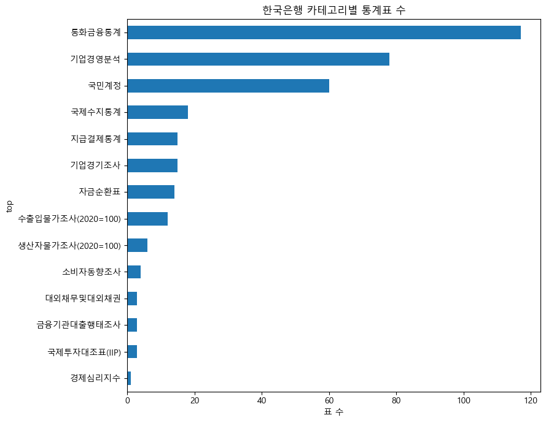
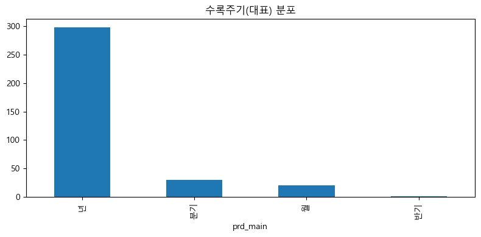
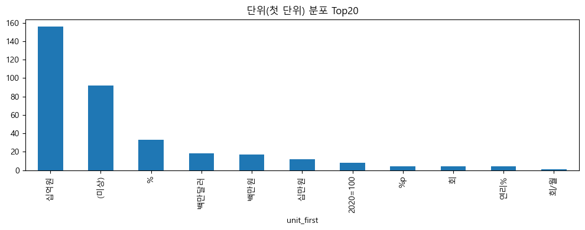
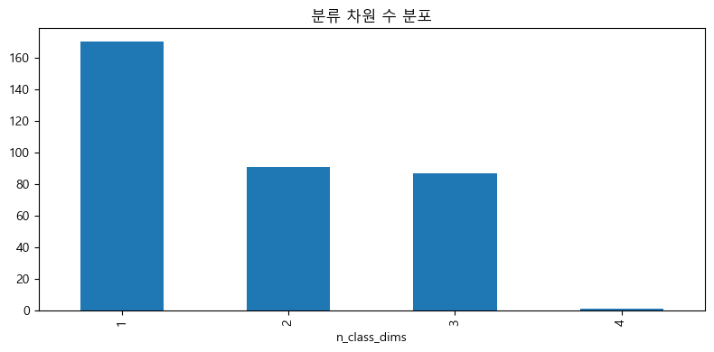
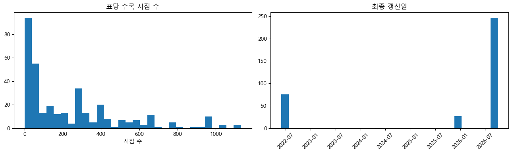
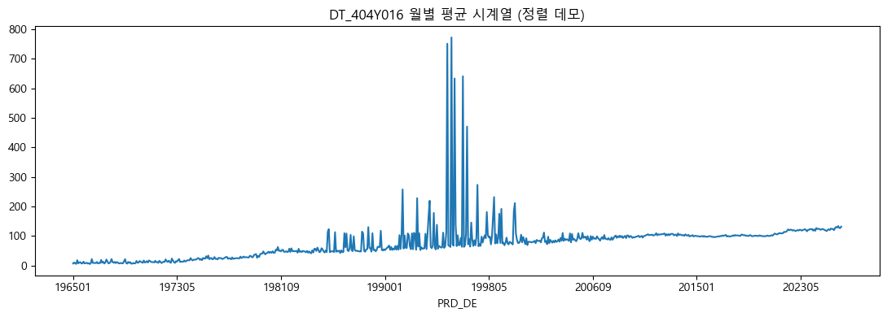

# 한국은행 통계표 EDA · QC 보고서

- **대상**: KOSIS Open API 내 **한국은행(기관코드 301) 소관 통계표 전체**
- **작성 목적**: 자연어 통계 탐색·시각화 에이전트 프로젝트의 **1주차 산출물** — 데이터 관찰(EDA)과 품질 점검(QC)
- **데이터 출처**: KOSIS 공유서비스 Open API (`statisticsList.do`, `statisticsData.do`, `Param/statisticsParameterData.do`)
- **수집일**: 2026-10-01
- **분석 노트북**: `notebooks/01_한국은행_통계표_EDA_QC.ipynb`
- **데이터 위치**: `data/` (`catalog/`, `meta/`, `raw/`, `qc/`)
- **작성**: StatBridge 팀 내부용

---

## 1. 개요

### 1.1 배경
KOSIS에는 수십만 건의 통계표가 있고, 한국은행 소관 표만 해도 수백 개에 이른다. 표 이름·분류 항목이 행정 용어 중심이라 사용자의 표현과 차이가 크고, 여러 표를 함께 보려면 시점·주기·단위가 달라 수작업 정합이 필요하다. 본 단계에서는 **한국은행 소관 통계표의 전체 목록과 실제 수치 구조를 수집·관찰**하여, 이후 검색기·골든셋·MCP 서버 개발의 기반을 확보한다.

### 1.2 범위
- **대상 표**: KOSIS 통계목록(기관별, `MT_OTITLE`)에서 **한국은행(301) 하위 통계표 전체**
- **수집 수준**: 각 표의 **전체 시점·전체 항목·전체 분류** 수치 + 메타정보(분류·항목·단위·주기·출처)
- **원칙**: 표/그래프에 쓰이는 모든 수치는 **API 조회 결과만** 사용(모델 생성 금지)

### 1.3 핵심 요약
| 항목 | 결과 |
|---|---|
| 한국은행 통계표 | **349개** (최상위 분류 14개) |
| 전체 수치 행 | **10,169,999 행** |
| 수집 성공 | **349 / 349 (실패 0)** |
| 값 결측·비수치 | **0 행** |
| 시점 형식 이상 | **0 행** |
| 중복 레코드(완전 키) | **0 행** |
| 총 API 호출 | 3,279회 (레이트리밋 0회) |

---

## 2. 수집 방법

### 2.1 카탈로그 (통계표 목록)
- 통계목록 API를 `parentListId`로 **재귀 탐색**하여 `카테고리(LIST_ID) → 통계표(TBL_ID)` 트리를 순회
- 최상위(기관 목록)는 `parentListId` 생략, 하위는 직전 응답의 `LIST_ID`를 전달
- 결과: **349개 표**, 카테고리 노드 133개, `TBL_ID` 중복 0

### 2.2 메타정보
각 표에 대해 다음 메타를 수집한다.

| 메타 유형 | 내용 |
|---|---|
| `type=TBL` | 통계표 국·영문명 |
| `type=ORG` | 작성기관 |
| `type=UNIT` | 단위 |
| `type=PRD&detail=Y` | 수록주기 및 **전체 수록시점 목록** |
| `type=SOURCE` | 조사명·담당부서 |
| `type=ITM` | **분류/항목 구조** (차원 수·코드) |

> `type=PRD` 응답은 `PRD_SE`(주기)가 별도 행에 한 번, 이후 행은 `PRD_DE`(시점)만 온다.

### 2.3 데이터 조회 규칙 (검증 완료)
- **`objL` 파라미터 개수는 분류 차원 수와 정확히 일치**해야 한다. 적으면 `err20`, 많으면 `err21` → `type=ITM`으로 차원 수를 산출해 결정
- `itmId=ALL`, `objL*=ALL`, `newEstPrdCnt=10000`으로 **전체 시점** 수집
- 결과가 **40,000셀을 초과하면 `err31`** → 분류 차원 크기로 **윈도우를 미리 계산**해 기간 단위로 청킹
- 수치는 KOSIS가 **HTTP 200으로 오류를 반환**하는 경우가 있어, 본문 `err` 키를 반드시 검사

### 2.4 성능·안정성
- **동시 수집**: 워커 6개 + 스레드 안전 **토큰버킷(180회/분)** 으로 분당 200회 제한 준수
- **스레드별 세션**, 지수 백오프 재시도
- **표별 JSON 캐시 + 증분 저장** → 중단 후 재개 가능(Colab은 Drive, 로컬은 프로젝트 루트 `data/`)

---

## 3. 데이터 현황 (EDA)

### 3.1 규모
- **349개 표**, **10,169,999 행**
- 표당 수록 시점: 중앙값 **121**, 최대 **1,131** (전체 시점 합 83,607)
- 최종 갱신일 분포: **2022-05-31 ~ 2026-10-01**

### 3.2 카테고리별 표 수

| 카테고리 | 표 수 | | 카테고리 | 표 수 |
|---|---:|---|---|---:|
| 통화금융통계 | 117 | | 생산자물가조사(2020=100) | 6 |
| 기업경영분석 | 78 | | 소비자동향조사 | 4 |
| 국민계정 | 60 | | 국제투자대조표(IIP) | 3 |
| 국제수지통계 | 18 | | 금융기관대출행태조사 | 3 |
| 기업경기조사 | 15 | | 대외채무및대외채권 | 3 |
| 지급결제통계 | 15 | | 경제심리지수 | 1 |
| 자금순환표 | 14 | | **합계** | **349** |
| 수출입물가조사(2020=100) | 12 | | | |

> **통화금융통계(117) + 기업경영분석(78) + 국민계정(60)** 이 전체의 약 73%를 차지한다.

### 3.3 수록주기 분포

| 주기(PRD_SE) | 행 수 | 비중 |
|---|---:|---:|
| 월 (M) | 4,382,207 | 43.1% |
| 연 (A) | 3,041,447 | 29.9% |
| 분기 (Q) | 2,678,211 | 26.3% |
| S | 68,134 | 0.7% |

### 3.4 단위 분포

| 단위 | 행 수 | 비고 |
|---|---:|---|
| `2020＝100` 외 지수 | 3,499,104 | 지수(기준연도 상이: 2020/2021/2022/2024/2025) |
| 십억원 | 2,450,648 | 금액 |
| % | 877,465 | 비율 |
| 백만원 | 779,979 | 금액 |
| 백만달러 | 595,560 | 금액 |
| 회 | 69,790 | 횟수 |
| 연리% | 49,319 | 금리 |
| %p | 40,611 | 증감 |
| 천건 / 건 | 72,085 | 건수 |
| **(단위 없음)** | **1,685,872** | **전체의 16.6%** |

> 지수·금액·비율·건수가 혼재한다. **단위가 다른 계열을 한 그래프에 그리면 안 된다.**

### 3.5 분류 차원 수

| 분류 차원 수 | 표 수 |
|---|---:|
| 1차원 | 170 |
| 2차원 | 91 |
| 3차원 | 87 |
| 4차원 | 1 |

> 차원 수는 데이터 조회 시 **`objL` 파라미터 개수**를 결정하므로 수집에 직접 영향을 준다.

### 3.6 수록기간·갱신일

### 3.7 표 제목 키워드 (검색기 씨앗)
| 키워드 | 빈도 | 키워드 | 빈도 | 키워드 | 빈도 |
|---|---:|---|---:|---|---:|
| 말잔 | 50 | 표본조사 | 36 | 계절조정계열 | 22 |
| 분기 | 42 | 지역별 | 27 | 실질 | 21 |
| 원계열 | 41 | 상품별 | 26 | 계절조정 | 18 |
| 연간 | 40 | 지표 | 25 | 경제활동별 | 13 |
| 명목 | 38 | 평잔 | 25 | 자산/자본 | 12 |
| 구성내역 | 38 | 예금은행 | 25 | 최종소비지출 | 11 |

> "말잔/평잔", "원계열/계절조정계열", "명목/실질"은 **같은 지표의 변형**이므로 검색·선택 단계에서 구분이 필요하다.

---

## 4. 품질 점검 (QC)

QC는 두 층으로 구성된다: **① 수집이 잘 됐는가**, **② 값 자체가 깨끗한가**.

### 4.1 수집 QC
| 상태 | 표 수 | 의미 |
|---|---:|---|
| FULL | 258 | 단일 호출로 전체 수집 |
| FULL+FULL(chunked) | 24 | 일부 주기 청킹 포함 |
| FULL(chunked) | 61 | 40k 초과로 기간 청킹하여 전체 수집 |
| FULL+NODATA | 6 | 일부 주기에 데이터가 없음(정상) |
| **합계** | **349** | **실패 0** |

- 총 API 호출 **3,279회**, 레이트리밋(`err40`) **0회**
- **40,000셀 초과로 청킹이 필요했던 표: 85개** (FULL(chunked) 61 + FULL+FULL(chunked) 24)

### 4.2 값 QC
| 점검 | 결과 |
|---|---|
| DT 결측·비수치 | **0 행** |
| 시점(PRD_DE) 형식 이상 | **0 행** |
| 중복(항목 + C1~C8 + 주기 + 시점 완전 키) | **0 행** |

### 4.3 단위 스케일 점검 (단위별 값 범위)
| 단위 | 건수 | 최소 | 중앙값 | 최대 | 해석 |
|---|---:|---:|---:|---:|---|
| 2020＝100 | 515,688 | 0 | 94.87 | 1,275,846 | 지수(기준선 100) |
| 십억원 | 361,968 | -4,134,147 | 819 | 163,759,700 | 금액(음수=순상환 등) |
| % | 129,848 | -118,843,000 | 7 | 4,991,610 | 비율/증가율 |
| 백만원 | 114,771 | -87,441,540 | 479,165 | 143,649,600,000 | 금액 |
| 백만달러 | 87,416 | -168,826 | 54.4 | 2,509,271 | 금액 |

> 값 자체는 결측·비수치가 없으나, **스케일(지수 vs 금액)과 단위 혼재**가 병합·시각화의 실질적 난점이다.

---

## 5. 특이사항 및 문제 해결 기록

### 5.1 `DT_105Y001` — KOSIS가 **깨진 JSON**을 반환
- 증상: 수집 실패(`err20`, `objL` 파라미터 오류)로 보임
- 실제 원인: KOSIS 응답의 영문 항목명에 **유효하지 않은 이스케이프**(`"Up to \100 million"` 등 **6곳**)가 포함되어 `json.loads` 실패
- 연쇄: ITM 메타 파싱 실패 → **분류 차원 수를 못 읽음** → `objL` 개수 0 → `err20`
- 조치: **관대한 JSON 파싱**(잘못된 `\` 이스케이프 자동 보정) 도입
- 결과: 분류 차원 3개(ACC_ITEM·GUBUN_CD·AMT_CD) 확인, **3,552행 정상 수집**
- 결론: **MCP 문제가 아니라 KOSIS Open API의 데이터 결함**이며, 클라이언트 파싱 강건화로 해결

### 5.2 6개 표의 `NODATA` — 데이터가 실제로 없음
- 대상: `DT_161Y001/003/005/007/009/011`
- 실측: `월(M)` 정상, `년(Y)` 정상, **`분기(Q)`만 `err30: 데이터가 존재하지 않습니다`**
- 조치: `err30`을 실패가 아닌 **`NODATA`(해당 주기 없음)** 로 표기
- 결론: **버그 아님** — 메타가 광고한 주기의 자료가 실제로 부재

### 5.3 `prdSe`를 무시하는 표 — 중복 방지
- 일부 표는 요청한 주기와 무관하게 **자기 네이티브 주기** 데이터를 반환(예: `DT_105Y001`은 반기로 광고되나 실제 `S`)
- 조치: 수집 후 **완전 키 기준 중복 제거**를 적용 → 표 간·주기 간 중복 유입 방지

### 5.4 단위 결측
- 전체의 **16.6%(1,685,872행)** 가 `UNIT_NM` 미기재(주로 지수성 계열)
- 영향: 병합·그래프 작성 시 "단위 없음" 처리 필요 → 메타의 대표 단위 또는 지수 기준 사용 권장

---

## 6. 병합 가능성 분석

### 6.1 주기 × 단위 동일 그룹 (병합 후보)
| 주기 | 단위 | 표 수 | 대표 예시 |
|---|---|---:|---|
| 년 | 십억원 | 138 | 경제활동별 GDP 및 GNI, 지출항목별 GDP 등 |
| 년 | % | 31 | 성장성·손익·생산성 지표(기업경영분석) |
| 년 | 백만달러 | 17 | 국제수지, 서비스무역세분류통계 |
| 년 | 백만원 | 17 | 재무상태표·손익계산서(기업경영분석) |
| 분기 | 십억원 | 16 | 경제활동별 GDP 및 GNI(분기) |
| 년 | 십만원 | 12 | 차주당 가계대출 신규취급액·잔액 |
| 년 | 연리% | 4 | 예금은행 수신·대출금리(잔액 기준) |

> **동일 (주기, 단위) 그룹 내 표들이 1차 병합 후보**다. 예: "기준금리와 대출금리"는 모두 월 단위 금리 계열로 정합 가능.

### 6.2 시계열 정렬 (데모)

- 예시 표 `DT_404Y016`(생산자물가지수)을 시점 정렬 → 1965-01 ~ 2026-08, 740개 시점
- 병합 시 **주기(M/Q/A/S)·단위·시점 표기를 먼저 정합**해야 한다

### 6.3 사용자 표현 ↔ 통계표 명칭 매핑 후보
| 사용자 표현 | 후보 표 수 | 대표 예시 |
|---|---:|---|
| 대출 | 35 | 대출행태서베이(대출수요/태도/신용위험) |
| 기업경기 | 14 | 기업경기조사(실적/전망) |
| 통화 | 13 | 지역별·국가별 결제통화 |
| 물가 | 13 | 국내공급물가지수, 생산자물가지수 |
| 성장 | 10 | 경제활동별 성장기여도 |
| 금리 | 9 | 예금은행 수신·대출금리 |
| 소비자 | 3 | 소비자동향조사 |

> 검색기 설계 시 이 매핑이 **동의어·표현 차이 극복**의 출발점이 된다.

---

## 7. 결론 및 다음 단계

### 7.1 결론
- 한국은행 소관 통계표 **349개 전체**를 수집·관찰했고, **수치 자체는 매우 깨끗**하다(결측·비수치·형식 이상·중복 모두 0).
- 실질적 난점은 **수집이 아니라 정합**에 있다: ① 주기(M/A/Q/S) 혼재, ② 단위(지수/금액/비율/건수) 혼재, ③ 같은 지표의 변형(말잔·평잔, 원계열·계절조정, 명목·실질).
- KOSIS Open API 특유의 함정(깨진 JSON, HTTP 200 오류, 40k 셀 제한, prdSe 무시)을 **클라이언트에서 처리**했다.

### 7.2 다음 단계
1. **02 골든셋**: 위 매핑 후보를 씨앗으로 단일/복수/무응답/애매 질의 골든셋 제작
2. **검색기**: 표 제목·분류·항목 임베딩 + 키워드 하이브리드 검색, 리랭킹
3. **MCP 서버**: 탐색/메타/조회/병합/시각화 툴 구현(요청 시점에 KOSIS 조회)
4. **평가 체계**: 탐색·조회·병합·시각화 단계별 + End-to-End 성능 분리 측정

---

## 8. 부록

### 8.1 산출물
| 경로 | 내용 |
|---|---|
| `data/catalog/kosis_hankuk_catalog.{json,csv}` | 한국은행 통계표 카탈로그(349) |
| `data/meta/<tbl_id>.json` | 표별 메타(차원·주기·단위·출처) — 349+ |
| `data/raw/<tbl_id>.json` | 표별 실제 수치(`rows`, 상태, 중복 제거 수) — 349 |
| `data/qc/collection_summary.csv` | 표별 수집 상태 |
| `data/qc/qc_report.csv` | QC 리포트 |
| `data/qc/collect_failures.csv` | 실패/부분 표(현재 0건) |
| `notebooks/figures/*.png` | 보고서 삽입 차트 |

### 8.2 재현 방법
1. 노트북 `notebooks/01_한국은행_통계표_EDA_QC.ipynb` 실행 (Colab 또는 로컬 Jupyter)
2. 인증키: Colab Secrets(`KOSIS_API_KEY`) / 환경변수 / 프로젝트 루트 `.env` / 직접입력
3. 저장 위치: Colab이면 Google Drive, 로컬이면 프로젝트 루트 `data/`
4. 최초 전체 수집 시 메타 ~1,500 + 데이터 ~3,100 호출 ≈ **약 30분 내외**, 캐시로 재개 가능

### 8.3 한계 및 주의
- QC 통계(값 수준)는 노트북에서 **1,500,000행 샘플**로 산출(단, 전체 행 수·중복은 전수 확인)
- 1개 시점이 40,000셀을 넘는 초대형 표는 부분수집/`UNSAMPLED`로 기록될 수 있음(현재 해당 없음)
- 단위 결측 16.6%는 원천 데이터 특성으로, 병합·시각화 시 명시적 처리 필요
- KOSIS 응답은 시점에 따라 신규 갱신될 수 있으므로, 재현 시 수치가 달라질 수 있음(수집일 2026-10-01 기준)

---

*본 보고서의 모든 수치는 KOSIS Open API 조회 결과(수집일 2026-10-01)만 사용했습니다.*
